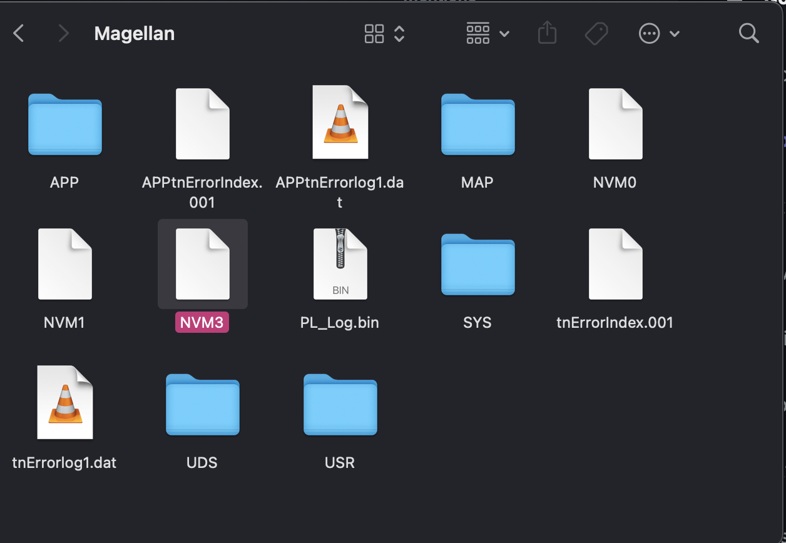
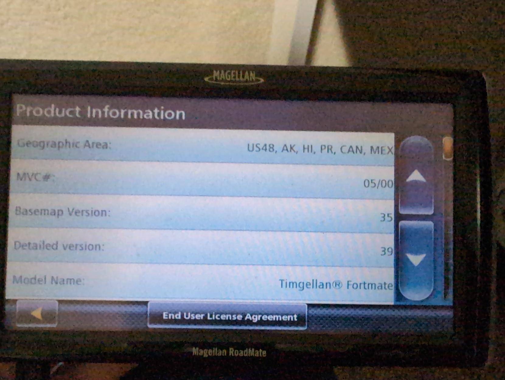

a few months ago i picked up this magellan roadmate 1700 tablet from a garage sale for only $15, along with some [other various trinkets](https://wetdry.world/@thememesniper/112808712085232597).

i was expecting this to be like most embedded devices, where you'd have to crack the thing open and find a UART header and hook up gadgets and whatnot, but NOPE! when you connect this thing to a computer via the USB mini B port on the bottom... it mounts the entire system data partition? apparently this is to account for their lack of a proper update mechanism, where you go to a Shady Website and extract a zip file into your navigator, and presumably overwrites the old maps or whatever.

naturally, i was inclined to poke around the device and see what funny things i could do to it. one of the first things i discovered was that every file on this thing was read/write, meaning i had a ton of possibilites at my fingertips already. the next thing i leared after that, however, is that macOS REALLY does not like this tablet. like, REALLY hates it. like, "i will not read/write ANY data until you get this shit unfucked for me" hates it.

fortunately for me, linux does not care, so i was able to take a full copy of the system data and then i was ready to have some fun. one of the first things i did after exploring for a bit was change the model name displayed in the system settings, since it resided in an XML file called `Unit.xml` and i wanted to test my limits on how much i could touch here before something goes Horribly Wrong.

this was exciting! i had an embedded device with editable system contents. what more could i do?

after a bit of digging i found some WAV files, one belonging to the sound that plays every time you click a button, and i also found that the EULA for this device was stored in a text file.

<video controls src="/videos/blog/magellan-gps-woes/founder-of-epic-eula.mp4" alt="video of me opening the EULA on the gps tablet, where it says Magellan End-User License Agreement: I'm Tim Sweeney I'm the founder of Epic Games. i click the back button and it plays the line from the owner of epic games house tour video" />

after this, there wasn't really much i could do. i did try to launch the other binaries on the tablet by abusing the `Unit.xml` file i found earlier in combination with `Startup.xml`. `Unit.xml` also happened to keep track of which apps were on the system.

here's a list of how the binaries interacted with the system:

- `mgnshell.exe`: makes system bootloop, will crash `Navigator.exe` with an access violation if you try to use USB with it resident in memory
- `mgnQCS.exe`: does nothing
- `FAEWindow.exe`: does nothing
- `MassStorageFix.exe`: does nothing
- `Navigator.exe`: provides the map UI, probably a bad idea to try and launch this a second time, so i didn't try it

after this i was stumped on what to do next. since this is a pretty exotic machine (WinCE, 32-bit ARM), there wasn't much in the way for me to just make programs for this thing. i tried looking up how to get deeper into this system but all the sites i would go to in search of this information either led me to a dead link or something that didn't work.  according to [reports from people who were able to get to the bottom of this before me](https://ripitapart.com/2019/08/30/hacking-into-windows-ce-and-doom-on-the-magellan-roadmate-1412-gps-receiver/), it doesn't have any of the usual windows binaries (`cmd.exe`, `explorer.exe`, etc.) so that was a dead end. as far as i can tell all the toolchains for compiling stuff for this platform are dead in the water, so that option didn't exist either.

i know that the blog post i linked up here had the guy running some definitely not stock programs, but i wanted to have something funny beyond "It runs DOOM" (okay my wetdry-corrupted definiton of "funny" might not be helping here)

so after this i just tried to replace more files and see what happens. i tried replacing the button sound with the entirety of [Owner of epic games house tour!](https://www.youtube.com/watch?v=lRGUKMKadJ8), and what happens next will probably not shock you.

# The souls of the damned were released

as soon as it went past 5 seconds, i jumped in my chair. it started making screeching sounds which i can only assume is because of a buffer overrun in the audio player. after that i quickly muffled the speaker with electrical tape and replaced it with an audio file that won't do that again.

# conclusion

so we learned that embedded devices with speakers are the devil and WinCE is dead. what's next to do in my endless journey of exploring embedded devices? [hmmmmmmm....](https://wetdry.world/@thememesniper/112990078315111364) hopefully something without a speaker... 😵‍💫

